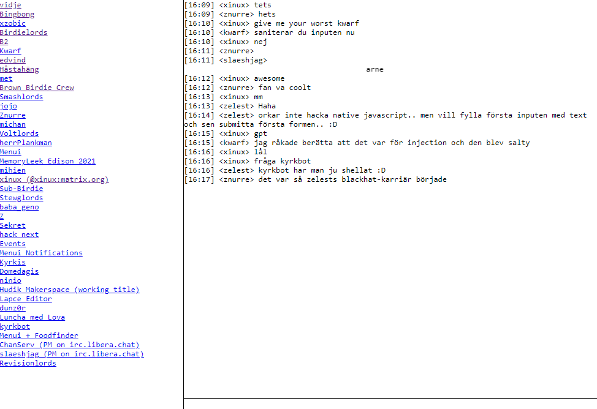

# mARC

A [matrix](https://matrix.org/) client daemon utilizing append-only static site generation. Inspired by the [mind-blowing speed](https://en.wikipedia.org/wiki/Brown-throated_sloth) and [simplicity](https://github.com/vector-im/element-web/issues) of [Element](https://github.com/vector-im/element-web/issues). 

## Usage
- Rename `.env.example` to `.env` and update the values
- Install dependencies: `pip install -r requirements.txt`
- Run client: `python mitm.py`
- Serve generated files with a http server of choice: `cd www && npx serve`

## Planned features
- Reaction emojis
- ~~Click on nick to quote~~
- ~~Multiline text (shift+enter)~~
- HTML patching from server
- Avoid duplication of logic in python + js
- ~~Combined room+people list~~
- ~~One statically generated html file per room~~
- ~~Use http api instead of simplematrixbotlib~~
- ~~Fetch history~~
- ~~/sync~~
- ~~Message sending~~
- ~~IRC-convention "edit history" (*fix)~~
- Flag but never delete messages
- Require browser cert when accessing the site and sending messages
- ~~Blocking http request waiting for room.html updates~~
- Script injection protection
- Usable search
- Hover to show image
- Easy setup

## Undecided on
- Reactions
- Typing status

## Features I'm looking forward to not implementing
- Daily notification that tells you to restart the client for an update that does nothing
- Spaces
- Threads
- Video or VoIP
- Historical revisionism (message deletion)
- Stickers

## Current state

## Resources
https://spec.matrix.org/v1.6/client-server-api/#get_matrixclientv3sync
https://gist.github.com/RickCogley/69f430d4418ae5498e8febab44d241c9